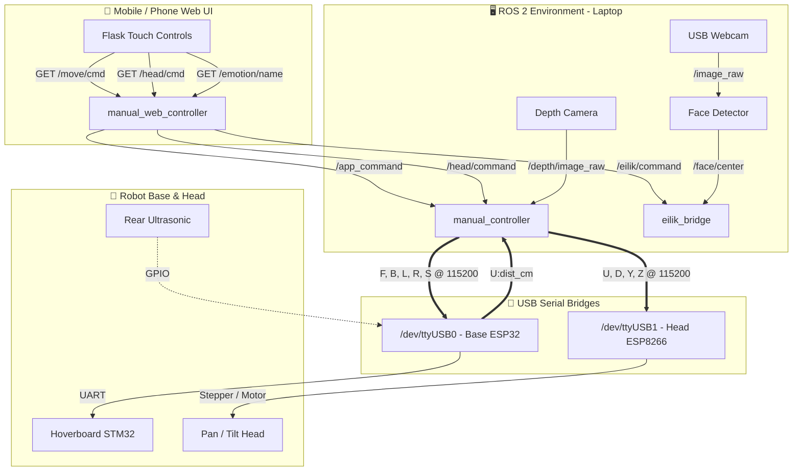

# 🏗️ System Architecture

## Overview
The system uses a three-tier architecture separating high-level perception and web interface (ROS 2) from low-level motor control (ESP32 for base, ESP8266 for head).

## Data Flow Diagram (Manual Teleoperation Mode)

